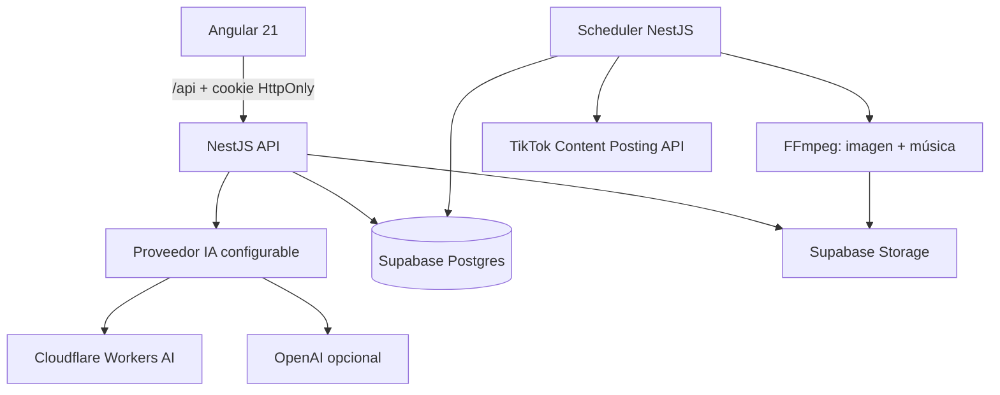

# Impulso IA — monorepo

Plataforma para generar lotes de contenido motivacional con IA, someter cada pieza a aprobación humana, programarla por fecha y publicarla en TikTok.

## Arquitectura



## Flujo de estados

`generating → pending_review → approved → scheduled → publishing → published`

- `pending_review`: el usuario debe revisar la frase, imagen, caption y hashtags.
- `approved`: aprobación humana registrada con usuario y fecha.
- `scheduled`: requiere fecha futura y música seleccionada.
- `failed`: conserva el error y el historial para reintento o diagnóstico.
- La restricción SQL impide que una pieza llegue a `scheduled`, `publishing` o `published` si no tiene `approved_at`.

## Carpetas

- `apps/web`: Angular 21 standalone, bandejas por estado, revisión y calendario.
- `apps/api`: NestJS, OpenAI, OAuth/Publicación TikTok, scheduler y FFmpeg.
- `packages/contracts`: contratos compartidos frontend/backend.
- `supabase/migrations`: tablas, índices, RLS, buckets privados y auditoría.

## Requisitos

- Node.js 22+
- Docker (para Supabase local y despliegue reproducible)
- FFmpeg 7+ en el servidor de la API
- Proyecto Supabase
- Cuenta de Cloudflare con Workers AI habilitado
- Token de API de Cloudflare con permiso `Workers AI Read` (OpenAI queda opcional)
- Aplicación TikTok Developer con Content Posting API

## Inicio local

```bash
cp apps/api/.env.example .env
npm install
npx supabase start
npx supabase db reset
npm run dev:api
npm run dev:web
```

Angular consume únicamente rutas relativas `/api`; no contiene URL ni claves de Supabase. En desarrollo, `proxy.conf.json` dirige `/api` a NestJS. En Docker, NGINX hace el mismo proxy al servicio `api`.

Configura en `.env` del backend `SUPABASE_URL`, `SUPABASE_PUBLISHABLE_KEY` y `SUPABASE_SECRET_KEY`. Nunca coloques secretos de Supabase, Cloudflare, OpenAI ni TikTok en Angular.

## Cloudflare Workers AI

1. En Cloudflare abre **AI > Workers AI** y copia el **Account ID**.
2. Ve a **My Profile > API Tokens > Create Token > Custom token**.
3. Asigna el permiso **Account > Workers AI > Read** para tu cuenta.
4. Copia `apps/api/.env.example` como `apps/api/.env` y configura:

```env
AI_PROVIDER=cloudflare
CLOUDFLARE_ACCOUNT_ID=tu_account_id
CLOUDFLARE_API_TOKEN=tu_token
CLOUDFLARE_TEXT_MODEL=@cf/google/gemma-4-26b-a4b-it
CLOUDFLARE_IMAGE_MODEL=@cf/black-forest-labs/flux-1-schnell
CLOUDFLARE_IMAGE_STEPS=4
```

5. Reinicia NestJS. No es necesario modificar Angular: todas las llamadas continúan pasando por `/api`.

El backend solicita la imagen sin texto y FFmpeg la escala y recorta a `1080x1920` al crear el video. El límite diario gratuito de Workers AI puede responder `429`; la API conserva la publicación como `failed` y devuelve un mensaje comprensible para poder regenerarla posteriormente.

## Configuración de Supabase

1. Ejecuta la migración de `supabase/migrations`.
2. Aplica también `202608110003_versions_music_and_tiktok.sql`; la pista de ejemplo queda deshabilitada porque no contiene un archivo real.
3. Abre **Música** en la aplicación y sube una pista original, licenciada o generada con IA. El backend valida formato y duración con FFprobe.
4. Mantén `generated-images`, `rendered-videos` y `music` como buckets privados.
5. Para producción, configura SMTP y las URLs de redirección de Supabase Auth.

Para aplicar las migraciones a un proyecto Supabase remoto vinculado:

```bash
npx supabase link --project-ref TU_PROJECT_REF
npx supabase db push
```

## Proveedores de IA

- Cloudflare Workers AI es el proveedor predeterminado para frases e imágenes.
- Selecciona `AI_PROVIDER=openai` para volver a Responses API y GPT Image cuando tengas créditos.
- Las imágenes se crean sin texto; FFmpeg superpone la frase para mantener tipografía consistente.
- Las credenciales viven exclusivamente en NestJS.

## TikTok y aprobación

TikTok requiere una aplicación registrada, OAuth y autorización del scope `video.publish`. Los clientes no auditados publican en modo privado. El ejemplo usa `SELF_ONLY` deliberadamente; cambia la privacidad únicamente después de implementar la pantalla de consentimiento exigida por TikTok y superar su auditoría.

Cuando el callback usa `http://localhost`, TikTok lo trata como Desktop Login Kit y exige PKCE. Mantén `TIKTOK_PKCE_ENABLED=true`: el backend crea un `code_verifier` temporal en una cookie HttpOnly, envía su desafío SHA-256 y elimina la cookie después del callback. En producción web con callback HTTPS puedes configurar `TIKTOK_PKCE_ENABLED=false` si tu aplicación fue registrada como Web.

El campo **Marca en la imagen** se define al crear cada paquete. Se persiste en Supabase y se reutiliza en las regeneraciones; la migración `202608110004_publication_brand_name.sql` agrega las columnas necesarias.

El scheduler consulta cada 30 segundos las publicaciones vencidas. Antes de publicar:

1. Reclama la fila de forma condicional (`scheduled → publishing`).
2. Descarga imagen y música privadas.
3. Renderiza un MP4 H.264/AAC de 1080×1920.
4. Sube el MP4 a Storage.
5. Inicializa Direct Post y transfiere el archivo.
6. Registra `published` o `failed` con auditoría.

## Endpoints principales

| Método | Ruta | Uso |
|---|---|---|
| `POST` | `/api/auth/magic-link` | Solicitar enlace de acceso mediante NestJS |
| `POST` | `/api/auth/session` | Convertir el callback de Supabase en cookies HttpOnly |
| `POST` | `/api/auth/refresh` | Renovar la sesión HttpOnly |
| `POST` | `/api/auth/logout` | Cerrar la sesión del navegador |
| `GET` | `/api/auth/me` | Consultar el usuario autenticado |
| `GET` | `/api/publications?status=pending_review` | Bandeja filtrada |
| `POST` | `/api/publications/generate` | Generar 2–3 piezas |
| `POST` | `/api/publication-batches/:id/generate-next` | Generar la siguiente pieza y mostrar progreso |
| `PATCH` | `/api/publications/:id/approve` | Aprobar contenido |
| `PATCH` | `/api/publications/:id/reject` | Rechazar contenido |
| `POST` | `/api/publications/:id/regenerate` | Crear otra frase e imagen |
| `PATCH` | `/api/publications/:id/schedule` | Asignar fecha y música |
| `GET` | `/api/tiktok/authorize-url` | Iniciar OAuth |
| `POST` | `/api/tiktok/callback` | Guardar tokens cifrados |
| `GET` | `/api/music` | Listar música verificada con preview temporal |
| `POST` | `/api/music` | Subir y validar una pista (multipart) |

Cuando Supabase limita el reenvío del enlace, NestJS responde `429` con el código `AUTH_RATE_LIMIT`, un mensaje público en español y `retryAfterSeconds`. Los detalles internos del proveedor se conservan únicamente en los logs del backend. Angular muestra el mensaje mediante una notificación accesible y bloquea los botones mientras cada petición está en curso.

## Pendientes antes de producción

- Añadir consulta periódica del estado de publicación de TikTok.
- Implementar idempotency keys y reintentos con backoff.
- Sustituir el cron integrado por una cola durable (BullMQ/Redis o Supabase Queues) al escalar a varios workers.
- Integrar moderación y pruebas de prompts con casos reales.
- Integrar un proveedor específico de generación musical si se desea crear audio dentro de la app; actualmente admite y verifica audio generado externamente con IA.
- Configurar dominio verificado, auditoría y UX obligatoria de TikTok.
- Añadir pruebas E2E contra proyectos de prueba de Supabase/OpenAI/TikTok.

## Seguridad

- RLS activado en tablas expuestas y assets privados.
- Angular no accede directamente a Supabase ni almacena tokens en `localStorage`.
- Tokens de Supabase guardados en cookies `HttpOnly`, `SameSite=Lax` y `Secure` en producción.
- JWT de Supabase verificado en la API y refresh gestionado por NestJS.
- Secret key de Supabase solo en backend.
- Tokens de TikTok cifrados con AES-256-GCM.
- Auditoría inmutable de transiciones.
- La API no acepta una programación si la pieza no está aprobada.
